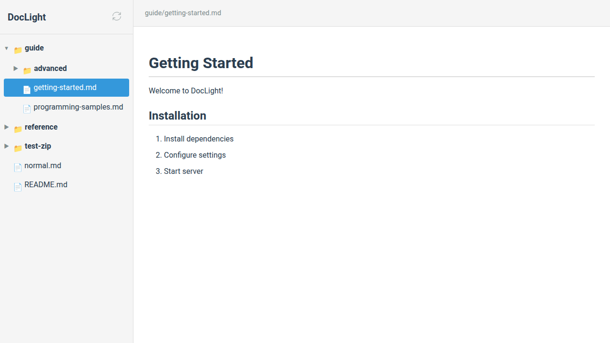

# Auto-Load Feature Test Report

## Test Date
2025-10-23

## Test Scenario
Testing the "last opened document auto-load" feature that should:
1. Save the currently opened file to IndexedDB
2. On page refresh, automatically load the last opened file
3. Expand parent folders to show the file in the tree
4. Mark the file as active

## Test Results

### ✅ WORKING: IndexedDB Storage
- **Status**: PASS
- **Evidence**: IndexedDB correctly saves the file path after clicking
- **Data Found**:
  ```json
  {
    "exists": true,
    "path": "guide/getting-started.md",
    "timestamp": 1761207764222,
    "dbName": "doclight",
    "version": 1,
    "storeNames": ["lastOpened", "treeState"]
  }
  ```

### ❌ FAILING: Auto-Load on Refresh
- **Status**: FAIL
- **Expected**: File should load automatically after refresh
- **Actual**: Welcome screen appears, file not loaded
- **Evidence**:
  - Breadcrumb after refresh: "문서를 선택하세요" (Please select a document)
  - Guide folder NOT expanded
  - File NOT visible in tree
  - File NOT marked as active

### 🔍 Root Cause Analysis

#### Issue Identified
The `getLastOpened()` function appears to be failing silently. Despite IndexedDB containing the correct data, the init() function is not loading the file.

#### Evidence
1. **No Console Logs**: No warnings or errors from the auto-load logic
2. **Silent Failure**: The try-catch block at lines 537-546 catches errors but logs nothing
3. **IndexedDB Works**: Manual IndexedDB queries return correct data

#### Potential Causes

**Most Likely: Async/Await Issue with IndexedDB**
```javascript
// Current code (lines 64-69)
async function getLastOpened() {
  const tx = db.transaction('lastOpened', 'readonly');
  const store = tx.objectStore('lastOpened');
  const result = await store.get('file');  // ⚠️ PROBLEM
  return result ? result.path : null;
}
```

The `store.get('file')` returns an `IDBRequest` object, NOT a Promise. Using `await` on an IDBRequest without wrapping it in a Promise may cause undefined behavior or silent failures.

**Correct Implementation Should Be**:
```javascript
async function getLastOpened() {
  return new Promise((resolve, reject) => {
    const tx = db.transaction('lastOpened', 'readonly');
    const store = tx.objectStore('lastOpened');
    const request = store.get('file');

    request.onsuccess = () => {
      const result = request.result;
      resolve(result ? result.path : null);
    };

    request.onerror = () => {
      reject(request.error);
    };
  });
}
```

#### Same Issue in `saveLastOpened()`
```javascript
// Current code (lines 57-61)
async function saveLastOpened(path) {
  const tx = db.transaction('lastOpened', 'readwrite');
  const store = tx.objectStore('lastOpened');
  await store.put({ key: 'file', path, ts: Date.now() });  // ⚠️ PROBLEM
}
```

**Correct Implementation**:
```javascript
async function saveLastOpened(path) {
  return new Promise((resolve, reject) => {
    const tx = db.transaction('lastOpened', 'readwrite');
    const store = tx.objectStore('lastOpened');
    const request = store.put({ key: 'file', path, ts: Date.now() });

    request.onsuccess = () => resolve();
    request.onerror = () => reject(request.error);
  });
}
```

## Screenshots

### Before Refresh

- File "guide/getting-started.md" is loaded
- Breadcrumb shows correct path
- File is highlighted in tree

### After Refresh

- Welcome screen displayed
- No file loaded
- Tree in collapsed state

## Recommendation

### Fix Required
Update the IndexedDB functions to properly wrap IDBRequest operations in Promises:

1. **Fix `getLastOpened()` function** (lines 64-69)
2. **Fix `saveLastOpened()` function** (lines 57-61)
3. **Fix `getTreeState()` function** (lines 48-54) - Same issue
4. **Fix `saveTreeState()` function** (lines 42-46) - Same issue

### Testing After Fix
After applying the fixes, re-run the test with:
```bash
node test-auto-load-final.js
```

Expected result: All checks should PASS:
- ✅ Breadcrumb correct
- ✅ Folder auto-expanded
- ✅ File visible in tree
- ✅ File marked as active
- ✅ Content loaded

## Additional Notes

The IndexedDB implementation works for manual testing because the operations complete fast enough that the data appears to be saved. However, when using `await` on IDBRequest objects without Promise wrapping, the actual Promise resolution may not work correctly, causing the auto-load logic to receive undefined or incorrect values.

This is a common pitfall when working with IndexedDB in async/await code.
