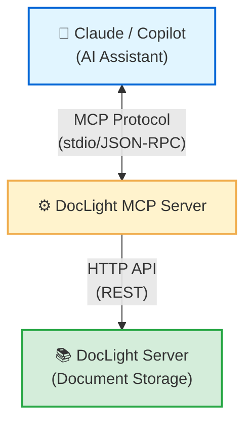

# DocLight MCP Server Documentation

Version: 1.0.0 | Last Updated: 2025-10-24

## Table of Contents

1. [Introduction](#introduction)
2. [What is MCP?](#what-is-mcp)
3. [Installation](#installation)
4. [Configuration](#configuration)
5. [Integration Guides](#integration-guides)
6. [Available Tools](#available-tools)
7. [Usage Examples](#usage-examples)
8. [Troubleshooting](#troubleshooting)

---

## Introduction

The DocLight MCP Server enables AI assistants (like Claude, GitHub Copilot, and others) to interact with your DocLight documentation system through the Model Context Protocol (MCP).

**Key Benefits**:
- AI assistants can read, create, update, and delete documents
- Natural language document management
- Seamless integration with existing tools
- No UI required for document operations

**Architecture**:



---

## What is MCP?

### Model Context Protocol Overview

MCP (Model Context Protocol) is an open standard developed by Anthropic that defines how applications share context with large language models (LLMs). It enables AI assistants to securely interact with external systems and data sources.

**Key Concepts**:

| Concept | Description |
|---------|-------------|
| **Server** | Provides tools and resources to AI assistants |
| **Client** | AI assistant or application that uses MCP servers |
| **Tools** | Functions that servers expose to clients |
| **Resources** | File-like data that servers can provide |
| **Prompts** | Pre-written templates for common operations |
| **Transport** | Communication mechanism (stdio, HTTP, WebSocket) |

**How MCP Works**:
1. MCP server connects to AI client via transport layer
2. Client discovers available tools via `tools/list` request
3. Client invokes tools via `tools/call` request with JSON-RPC
4. Server executes operations and returns results
5. Client presents results to user in natural language

**MCP vs Traditional APIs**:

| Aspect | Traditional API | MCP |
|--------|----------------|-----|
| Discovery | Manual documentation | Automatic via protocol |
| Integration | Custom code required | Native AI integration |
| Authentication | Various methods | Transport-specific |
| Error Handling | HTTP status codes | Structured JSON responses |
| Use Case | Direct programmatic access | AI-mediated interactions |

---

## Installation

### Prerequisites

- Node.js ≥ 18.0.0
- npm or yarn package manager
- DocLight server running
- API key configured in DocLight

### Installation Steps

**1. Navigate to MCP Server Directory**:

```bash
cd doclight-mcp-server
```

**2. Install Dependencies**:

```bash
npm install
```

This will install:
- `@modelcontextprotocol/sdk` - MCP protocol implementation
- `axios` - HTTP client for DocLight API
- `dotenv` - Environment variable management
- `form-data` - Multipart form data handling

**3. Configure Environment Variables**:

```bash
cp .env.example .env
```

Edit `.env`:
```bash
DOCLIGHT_URL=http://localhost:3000
DOCLIGHT_API_KEY=your-api-key-here
```

**4. Test Installation**:

```bash
npm start
```

Expected output:
```
DocLight MCP server running on stdio
```

Press Ctrl+C to stop the test.

---

## Configuration

### Environment Variables

| Variable | Required | Description | Example |
|----------|----------|-------------|---------|
| `DOCLIGHT_URL` | ✅ Yes | DocLight server URL | `http://localhost:3000` |
| `DOCLIGHT_API_KEY` | ✅ Yes | API key from config.json5 | `abc123...` |
| `LOG_LEVEL` | No | Logging verbosity | `info` (default), `debug`, `error` |

### Configuration Best Practices

**1. API Key Security**:
```bash
# Generate secure API key
openssl rand -hex 32
```

**2. URL Format**:
- ✅ Correct: `http://localhost:3000`
- ❌ Wrong: `http://localhost:3000/` (trailing slash)
- ❌ Wrong: `localhost:3000` (missing protocol)

**3. HTTPS for Production**:
```bash
DOCLIGHT_URL=https://docs.company.com
```

---

## Integration Guides

### 1. Claude Desktop Integration

Claude Desktop natively supports MCP servers through configuration files.

#### Configuration File Location

- **macOS**: `~/Library/Application Support/Claude/claude_desktop_config.json`
- **Windows**: `%APPDATA%\Claude\claude_desktop_config.json`
- **Linux**: `~/.config/Claude/claude_desktop_config.json`

#### Configuration Steps

**Step 1: Find Absolute Path**

Get the absolute path to your MCP server:

```bash
# On macOS/Linux
cd doclight-mcp-server
pwd
# Example output: /Users/username/projects/doclight-mcp-server

# On Windows (PowerShell)
cd doclight-mcp-server
(Get-Location).Path
# Example output: C:\Users\username\projects\doclight-mcp-server
```

**Step 2: Create/Edit Configuration File**

```json
{
  "mcpServers": {
    "doclight": {
      "command": "node",
      "args": ["/absolute/path/to/doclight-mcp-server/src/index.js"],
      "env": {
        "DOCLIGHT_URL": "http://localhost:3000",
        "DOCLIGHT_API_KEY": "your-api-key"
      }
    }
  }
}
```

**Important Notes**:
- Use **absolute paths** (full path from root)
- On Windows, use double backslashes: `C:\\Users\\...\\index.js` or forward slashes: `C:/Users/.../index.js`
- Replace `your-api-key` with actual API key from DocLight config.json5
- Ensure DocLight server is running before using MCP tools

**Step 3: Restart Claude Desktop**

1. Completely quit Claude Desktop (not just close the window)
2. Reopen Claude Desktop
3. Look for MCP server indicator in bottom-right corner of chat input

#### Alternative: Desktop Extensions (2025 Method)

**New Simplified Installation**:

1. Open Claude Desktop
2. Navigate to **Settings → Extensions**
3. Click **"Browse extensions"**
4. Search for "DocLight" (if published to extension directory)
5. Click **"Install"**
6. Configure environment variables in extension settings

**Extension File Format**: `.mcpb` (MCP Bundle) or legacy `.dxt`

**Note**: As of 2025, Anthropic is promoting Desktop Extensions as the preferred installation method. Check the Claude Desktop extension directory for available MCP servers.

#### Verification

Ask Claude:
```
"Can you list the documents in DocLight?"
```

Expected behavior:
- Claude shows available MCP tools (hammer icon)
- Uses `doclight_list` tool automatically
- Returns formatted document tree

If no response:
- Check configuration file syntax (valid JSON)
- Verify absolute path is correct
- Ensure DocLight server is running
- Check Claude Desktop logs: Menu → View → Toggle Developer Tools

---

### 2. GitHub Copilot Integration (VS Code)

GitHub Copilot added MCP support in VS Code version 1.99+.

#### Prerequisites

- Visual Studio Code 1.99 or later
- GitHub Copilot extension installed
- Active Copilot subscription (Free, Pro, or Pro+)

#### Configuration Methods

**Method 1: GitHub MCP Registry (Recommended)**

1. Open VS Code
2. Open Command Palette (Ctrl+Shift+P / Cmd+Shift+P)
3. Type: `Copilot: Manage MCP Servers`
4. Click `Browse GitHub MCP Registry`
5. Search for "DocLight" (if published)
6. Click `Add Server`

**Method 2: Manual Configuration**

**Configuration File Location**:
- **macOS/Linux**: `~/.config/Code/User/settings.json`
- **Windows**: `%APPDATA%\Code\User\settings.json`

**Add to settings.json**:

```json
{
  "github.copilot.mcpServers": {
    "doclight": {
      "command": "node",
      "args": ["/absolute/path/to/doclight-mcp-server/src/index.js"],
      "env": {
        "DOCLIGHT_URL": "http://localhost:3000",
        "DOCLIGHT_API_KEY": "your-api-key"
      }
    }
  }
}
```

#### Enterprise Policy Control

**Organization Administrators**:

GitHub Enterprise customers can control MCP access via policy settings:

```
Settings → Copilot → MCP servers in Copilot policy
```

Options:
- **Enabled**: Members can use MCP servers
- **Disabled** (default): MCP access blocked
- **Allow list**: Whitelist specific MCP servers

**Note**: Copilot Free, Pro, and Pro+ users are not affected by enterprise policies.

#### Verification

Open Copilot Chat in VS Code and ask:
```
@workspace List documents in DocLight
```

Expected behavior:
- Copilot recognizes DocLight MCP server
- Uses tools to fetch document list
- Displays results in chat panel

---

### 3. Continue.dev Extension

Continue.dev is an open-source VS Code extension with comprehensive MCP support.

#### Installation

1. Install Continue extension from VS Code marketplace
2. Click Continue icon in sidebar
3. Click gear icon → Open Config

#### Configuration

**File**: `~/.continue/config.json`

```json
{
  "models": [
    {
      "model": "claude-3-5-sonnet-20241022",
      "provider": "anthropic",
      "apiKey": "your-anthropic-api-key"
    }
  ],
  "mcpServers": {
    "doclight": {
      "command": "node",
      "args": ["/absolute/path/to/doclight-mcp-server/src/index.js"],
      "env": {
        "DOCLIGHT_URL": "http://localhost:3000",
        "DOCLIGHT_API_KEY": "your-api-key"
      }
    }
  }
}
```

#### Usage

1. Open Continue sidebar
2. Type message: "List documents in DocLight"
3. Continue automatically uses MCP tools
4. Results appear in conversation

**Advantages**:
- Works with multiple LLM providers
- Highly customizable
- Active open-source community
- Free and open-source

---

### 4. Custom MCP Client Integration

Build your own MCP client using the official SDK.

#### Installation

```bash
npm install @modelcontextprotocol/sdk
```

#### Example Implementation

```javascript
import { Client } from '@modelcontextprotocol/sdk/client/index.js';
import { StdioClientTransport } from '@modelcontextprotocol/sdk/client/stdio.js';

// Create transport
const transport = new StdioClientTransport({
  command: 'node',
  args: ['/path/to/doclight-mcp-server/src/index.js'],
  env: {
    DOCLIGHT_URL: 'http://localhost:3000',
    DOCLIGHT_API_KEY: 'your-api-key'
  }
});

// Create client
const client = new Client({
  name: 'my-mcp-client',
  version: '1.0.0'
}, {
  capabilities: {}
});

// Connect
await client.connect(transport);

// List available tools
const tools = await client.listTools();
console.log('Available tools:', tools);

// Call doclight_list tool
const result = await client.callTool({
  name: 'doclight_list',
  arguments: { path: '/' }
});
console.log('Documents:', result);

// Cleanup
await client.close();
```

#### HTTP Transport (Future)

DocLight MCP Server currently uses stdio transport. HTTP transport can be added:

```javascript
import { HttpClientTransport } from '@modelcontextprotocol/sdk/client/http.js';

const transport = new HttpClientTransport({
  url: 'http://localhost:3001/mcp',
  headers: {
    'Authorization': 'Bearer your-token'
  }
});
```

---

## Available Tools

### Tool Overview

DocLight MCP Server provides 5 core tools for document management:

| Tool | Purpose | Input | Output |
|------|---------|-------|--------|
| `doclight_list` | List documents | `path` (optional) | Tree structure |
| `doclight_read` | Read document | `path` (required) | Markdown content |
| `doclight_create` | Create document | `path`, `content` | Confirmation |
| `doclight_update` | Update document | `path`, `content` | Confirmation |
| `doclight_delete` | Delete document | `path` (required) | Confirmation |

---

### 1. doclight_list

**Description**: List all documents in a directory

**Input Schema**:
```json
{
  "path": {
    "type": "string",
    "description": "Directory path (default: root)",
    "default": "/"
  }
}
```

**Example Input**:
```json
{
  "path": "/guide"
}
```

**Example Output**:
```
📁 guide
  📄 getting-started.md
  📄 configuration.md
  📁 advanced
    📄 performance.md
    📄 security.md
```

**Use Cases**:
- Browse documentation structure
- Find specific documents
- Verify directory contents

---

### 2. doclight_read

**Description**: Read the content of a document

**Input Schema**:
```json
{
  "path": {
    "type": "string",
    "description": "Document path (e.g., guide/getting-started.md)",
    "required": true
  }
}
```

**Example Input**:
```json
{
  "path": "/guide/getting-started.md"
}
```

**Example Output**:
```markdown
# Getting Started with DocLight

DocLight is a lightweight Markdown viewer...

## Installation

1. Clone the repository
2. Install dependencies
...
```

**Use Cases**:
- Read documentation content
- Extract information from files
- Reference existing documentation

---

### 3. doclight_create

**Description**: Create a new document

**Input Schema**:
```json
{
  "path": {
    "type": "string",
    "description": "Document path (e.g., guide/new-doc.md)",
    "required": true
  },
  "content": {
    "type": "string",
    "description": "Markdown content",
    "required": true
  }
}
```

**Example Input**:
```json
{
  "path": "/guide/troubleshooting.md",
  "content": "# Troubleshooting\n\n## Common Issues\n\n..."
}
```

**Example Output**:
```
Successfully created/updated: guide/troubleshooting.md
```

**Use Cases**:
- Create new documentation
- Generate documentation from conversations
- Add new guides or tutorials

---

### 4. doclight_update

**Description**: Update an existing document (same as create - overwrites)

**Behavior**:
- If file exists → overwrites content
- If file doesn't exist → creates new file

**Input Schema**: Same as `doclight_create`

**Example**:
```json
{
  "path": "/guide/api.md",
  "content": "# API Reference\n\n[Updated content]"
}
```

**Use Cases**:
- Update existing documentation
- Fix errors in documents
- Add new sections to files

---

### 5. doclight_delete

**Description**: Delete a document

**Input Schema**:
```json
{
  "path": {
    "type": "string",
    "description": "Document path to delete",
    "required": true
  }
}
```

**Example Input**:
```json
{
  "path": "/guide/old-doc.md"
}
```

**Example Output**:
```
Successfully deleted: guide/old-doc.md
```

**Warning**: ⚠️ This operation is irreversible! Deleted files cannot be recovered unless backed up.

**Use Cases**:
- Remove outdated documentation
- Clean up test files
- Maintain documentation structure

---

## Usage Examples

### Example 1: Browsing Documentation

**User Query**:
> "Show me all documents in the guide folder"

**MCP Flow**:
1. AI assistant recognizes document listing request
2. Invokes `doclight_list` tool
3. Formats results for user

**Tool Call**:
```json
{
  "name": "doclight_list",
  "arguments": {
    "path": "/guide"
  }
}
```

**AI Response**:
> Here are the documents in the guide folder:
>
> 📁 guide
>   📄 getting-started.md
>   📄 configuration.md
>   📄 api-reference.md
>   📁 advanced
>     📄 performance.md
>     📄 security.md
>
> Would you like me to read any of these files?

---

### Example 2: Reading Documentation

**User Query**:
> "Read the getting-started.md file and summarize it"

**MCP Flow**:
1. Assistant invokes `doclight_read` tool
2. Receives Markdown content
3. Analyzes and summarizes content

**Tool Call**:
```json
{
  "name": "doclight_read",
  "arguments": {
    "path": "/guide/getting-started.md"
  }
}
```

**AI Response**:
> I've read the getting-started guide. Here's a summary:
>
> **Installation**:
> - Clone repository
> - Run `npm install`
> - Configure `config.json5`
>
> **First Steps**:
> - Start server with `npm start`
> - Access at http://localhost:3000
> - Configure docsRoot and apiKey
>
> The guide recommends starting with the configuration section before running the server.

---

### Example 3: Creating Documentation

**User Query**:
> "Create a troubleshooting guide with solutions for common server errors"

**MCP Flow**:
1. Assistant generates documentation content
2. Invokes `doclight_create` tool
3. Confirms creation

**Tool Call**:
```json
{
  "name": "doclight_create",
  "arguments": {
    "path": "/guide/troubleshooting.md",
    "content": "# Troubleshooting Guide\n\n## Server Won't Start\n\n**Symptom**: Error when running `npm start`\n\n**Solutions**:\n1. Check Node.js version (≥18 required)\n2. Verify config.json5 exists and is valid\n3. Check port availability\n\n## API Key Invalid\n\n**Symptom**: 401 Unauthorized responses\n\n**Solutions**:\n1. Verify X-API-Key header is present\n2. Check config.json5 apiKey matches\n3. Ensure no whitespace in key\n\n## Files Not Loading\n\n**Symptom**: 404 errors when opening documents\n\n**Solutions**:\n1. Verify docsRoot path is correct\n2. Check file permissions\n3. Ensure file has .md extension"
  }
}
```

**AI Response**:
> ✅ I've created a comprehensive troubleshooting guide at `/guide/troubleshooting.md` with solutions for:
> - Server startup issues
> - API authentication problems
> - File loading errors
>
> You can view it in DocLight or ask me to read it back to you.

---

### Example 4: Updating Documentation

**User Query**:
> "Update the API reference to include the new download endpoint"

**MCP Flow**:
1. Assistant reads existing API reference
2. Generates updated content
3. Invokes `doclight_update` tool

**Tool Calls**:
```json
// First: Read existing content
{
  "name": "doclight_read",
  "arguments": {
    "path": "/guide/api-reference.md"
  }
}

// Then: Update with new content
{
  "name": "doclight_update",
  "arguments": {
    "path": "/guide/api-reference.md",
    "content": "[Existing content + new download endpoint section]"
  }
}
```

**AI Response**:
> ✅ I've updated the API reference to include the new download endpoint. Added sections:
> - `GET /api/download/file` - Download single file
> - `GET /api/download/dir` - Download directory as ZIP
>
> The documentation now includes examples and error codes for both endpoints.

---

### Example 5: Deleting Documentation

**User Query**:
> "Delete the old migration guide, it's no longer relevant"

**MCP Flow**:
1. Assistant confirms which file to delete
2. Invokes `doclight_delete` tool
3. Confirms deletion

**Tool Call**:
```json
{
  "name": "doclight_delete",
  "arguments": {
    "path": "/guide/migration-v1.md"
  }
}
```

**AI Response**:
> ✅ I've deleted `/guide/migration-v1.md`. The file has been permanently removed from DocLight.
>
> ⚠️ Remember: This action cannot be undone. If you need the content later, you'll need to restore it from backups.

---

### Example 6: Complex Workflow

**User Query**:
> "Review all documentation in /guide, identify outdated content, and create a summary report"

**MCP Flow** (Multiple Tool Calls):

```json
// Step 1: List all documents
{
  "name": "doclight_list",
  "arguments": { "path": "/guide" }
}

// Step 2-N: Read each document
{
  "name": "doclight_read",
  "arguments": { "path": "/guide/getting-started.md" }
}
{
  "name": "doclight_read",
  "arguments": { "path": "/guide/configuration.md" }
}
// ... more reads ...

// Final: Create summary report
{
  "name": "doclight_create",
  "arguments": {
    "path": "/reports/doc-review-2025-10-24.md",
    "content": "# Documentation Review\n\n## Summary\n\n..."
  }
}
```

**AI Response**:
> ✅ I've completed the documentation review. Here's what I found:
>
> **Up-to-date** (3 files):
> - getting-started.md
> - configuration.md
> - api-reference.md
>
> **Needs Update** (2 files):
> - migration-v1.md (mentions deprecated features)
> - performance.md (outdated benchmarks)
>
> I've created a detailed report at `/reports/doc-review-2025-10-24.md` with recommended updates for each file.

---

## Troubleshooting

### MCP Server Not Connecting

**Symptom**: Claude/Copilot doesn't show DocLight tools

**Solutions**:

**1. Verify Absolute Paths**:
```bash
# Get absolute path (macOS/Linux)
cd doclight-mcp-server
pwd

# Get absolute path (Windows PowerShell)
cd doclight-mcp-server
(Get-Location).Path
```

Use the full path in configuration:
```json
"args": ["/full/path/to/doclight-mcp-server/src/index.js"]
```

**2. Check Configuration Syntax**:
```bash
# Validate JSON syntax
cat ~/.config/Claude/claude_desktop_config.json | python -m json.tool

# On Windows
type %APPDATA%\Claude\claude_desktop_config.json | python -m json.tool
```

**3. Verify Environment Variables**:
```bash
# Test MCP server manually
cd doclight-mcp-server
DOCLIGHT_URL=http://localhost:3000 \
DOCLIGHT_API_KEY=your-key \
node src/index.js
```

Expected output: `DocLight MCP server running on stdio`

**4. Check DocLight Server**:
```bash
# Verify DocLight is running
curl http://localhost:3000/healthz

# Expected response:
# {"status":"OK","timestamp":"...","uptime":123.45}
```

**5. Restart AI Client**:
- **Claude Desktop**: Quit completely (Cmd+Q / Alt+F4), then restart
- **VS Code**: Reload window (Ctrl+R / Cmd+R)

**6. Check Logs**:
- **Claude Desktop**: Menu → View → Toggle Developer Tools → Console tab
- **VS Code**: View → Output → Select "GitHub Copilot" or "Continue"

---

### Authentication Failures

**Symptom**: "API error: 401 - Unauthorized"

**Solutions**:

**1. Verify API Key Matches**:
```bash
# Check DocLight config
cat config.json5 | grep apiKey

# Check MCP .env
cat doclight-mcp-server/.env | grep DOCLIGHT_API_KEY
```

Keys must match exactly.

**2. Check for Whitespace**:
```bash
# Trim whitespace in .env
DOCLIGHT_API_KEY="$(echo 'your-key' | tr -d '[:space:]')"
```

**3. Regenerate API Key**:
```bash
# Generate new key
openssl rand -hex 32

# Update both:
# 1. config.json5 (DocLight)
# 2. .env (MCP Server)
```

**4. Verify Header Transmission**:

Check MCP server logs for API requests:
```bash
LOG_LEVEL=debug npm start
```

Look for: `X-API-Key: abc123...`

---

### Path Not Found Errors

**Symptom**: "Failed to read document: File not found"

**Solutions**:

**1. Verify Path Format**:
- ✅ Correct: `/guide/api.md`
- ❌ Wrong: `guide/api.md` (missing leading slash)
- ❌ Wrong: `/guide/api` (missing extension)

**2. List Directory First**:

Ask AI:
```
"List files in /guide"
```

This confirms:
- Directory exists
- Correct file names
- Proper path structure

**3. Check docsRoot Configuration**:
```bash
# Verify file exists on server
ls -la /path/to/docsRoot/guide/api.md
```

**4. Check File Permissions**:
```bash
# Ensure DocLight server can read files
chmod 644 /path/to/docsRoot/guide/*.md
```

---

### Connection Timeouts

**Symptom**: MCP requests timeout or hang

**Solutions**:

**1. Check Network Connectivity**:
```bash
# Test DocLight API directly
curl -v http://localhost:3000/api/tree
```

**2. Verify Firewall Rules**:
- Allow localhost connections
- Check port 3000 (or configured port) is open

**3. Check DOCLIGHT_URL Format**:
- ✅ Correct: `http://localhost:3000`
- ❌ Wrong: `http://localhost:3000/` (trailing slash)
- ❌ Wrong: `localhost:3000` (missing protocol)

**4. Increase Timeout** (if modifying client):
```javascript
// In client.js
axios({
  // ...
  timeout: 30000  // 30 seconds (default: 10s)
})
```

**5. Check DocLight Server Logs**:
```bash
# Monitor DocLight logs
tail -f logs/application-*.log
```

Look for incoming API requests and errors.

---

### Large File Upload Failures

**Symptom**: "Upload failed: Payload Too Large"

**Solutions**:

**1. Check maxUploadMB**:
```json5
// config.json5
{
  maxUploadMB: 10  // Increase if needed
}
```

**2. Restart DocLight Server**:
```bash
# Apply new configuration
npm start
```

**3. Split Large Documents**:

Instead of one 50MB file, create multiple smaller files:
```
/guide/large-doc-part1.md
/guide/large-doc-part2.md
/guide/large-doc-part3.md
```

**4. Optimize Markdown Content**:
- Remove unnecessary embedded images
- Link to external images instead
- Compress images before embedding

---

### Tool Execution Errors

**Symptom**: "Error: Failed to execute tool"

**Solutions**:

**1. Enable Debug Logging**:
```bash
LOG_LEVEL=debug npm start
```

**2. Verify Required Arguments**:

| Tool | Required Arguments |
|------|-------------------|
| `doclight_list` | None (path optional) |
| `doclight_read` | `path` |
| `doclight_create` | `path`, `content` |
| `doclight_update` | `path`, `content` |
| `doclight_delete` | `path` |

**3. Test with curl First**:
```bash
# Test read operation
curl "http://localhost:3000/api/raw?path=/test.md"

# Test upload operation
curl -X POST \
  -H "X-API-Key: your-key" \
  -F "file=@test.md" \
  "http://localhost:3000/api/upload?path=/"
```

**4. Check Error Messages**:

MCP server returns detailed error messages:
```json
{
  "content": [{
    "type": "text",
    "text": "Error: [Specific error description]"
  }],
  "isError": true
}
```

Read error message carefully for clues.

---

### VS Code MCP Configuration Issues

**Symptom**: Copilot doesn't recognize MCP server

**Solutions**:

**1. Check VS Code Version**:
```
Help → About

Required: VS Code 1.99 or later
```

**2. Verify Copilot Extension**:
- Open Extensions (Ctrl+Shift+X)
- Search "GitHub Copilot"
- Ensure extension is installed and enabled
- Check for updates

**3. Check Enterprise Policy**:

If using GitHub Enterprise:
1. Go to organization settings
2. Navigate to Copilot policies
3. Ensure "MCP servers in Copilot" is enabled

**4. Reload Window**:
```
Ctrl+Shift+P → Developer: Reload Window
```

**5. Check Settings**:
```
File → Preferences → Settings
Search: "copilot mcp"
Verify "GitHub Copilot: MCP Servers" setting exists
```

---

## Advanced Topics

### Multiple DocLight Instances

Connect to multiple DocLight servers simultaneously:

```json
{
  "mcpServers": {
    "doclight-prod": {
      "command": "node",
      "args": ["/path/to/index.js"],
      "env": {
        "DOCLIGHT_URL": "https://docs.company.com",
        "DOCLIGHT_API_KEY": "prod-key"
      }
    },
    "doclight-dev": {
      "command": "node",
      "args": ["/path/to/index.js"],
      "env": {
        "DOCLIGHT_URL": "http://localhost:3000",
        "DOCLIGHT_API_KEY": "dev-key"
      }
    }
  }
}
```

**Usage**:
```
"List documents in doclight-prod"
"Create a test file in doclight-dev"
```

AI assistant will route requests to the appropriate server.

---

### Custom Transport Layer

**Current**: stdio transport (stdin/stdout)
**Future**: HTTP transport for remote servers

**HTTP Transport Benefits**:
- Remote server access
- Load balancing
- Authentication layers
- Monitoring/logging

**Implementation** (future):
```javascript
import { HttpServerTransport } from '@modelcontextprotocol/sdk/server/http.js';

const transport = new HttpServerTransport({
  port: 3001,
  path: '/mcp',
  authentication: {
    type: 'bearer',
    token: 'secure-token'
  }
});
```

---

### Security Best Practices

**1. API Key Security**:
```bash
# Never commit API keys
echo ".env" >> .gitignore

# Use environment variables
export DOCLIGHT_API_KEY=$(cat .secrets/api-key)

# Rotate keys regularly
openssl rand -hex 32 > .secrets/new-key
```

**2. Network Security**:
```json5
// Use HTTPS in production
{
  ssl: {
    enabled: true,
    cert: "/path/to/cert.pem",
    key: "/path/to/key.pem"
  }
}
```

**3. IP Whitelisting**:
```json5
{
  security: {
    allows: [
      "127.0.0.1",           // localhost
      "10.0.1.0/24",         // office network
      "192.168.1.100"        // specific IP
    ]
  }
}
```

**4. Access Control**:
- Use separate API keys per environment
- Limit MCP server permissions
- Monitor API usage logs
- Implement rate limiting (future feature)

**5. Audit Logging**:
```bash
# Monitor MCP operations
tail -f logs/application-*.log | grep "MCP"

# Track API access
tail -f logs/application-*.log | grep "POST\|DELETE"
```

---

## Resources

### Official Documentation

- **MCP Protocol Spec**: [https://modelcontextprotocol.io](https://modelcontextprotocol.io)
- **MCP SDK**: [GitHub - @modelcontextprotocol/sdk](https://github.com/anthropics/mcp-sdk)
- **Claude Desktop**: [https://claude.ai/download](https://claude.ai/download)
- **GitHub Copilot MCP**: [GitHub Docs - Extending Copilot with MCP](https://docs.github.com/en/copilot/how-tos/context/model-context-protocol)

### Community Resources

- **MCP Servers List**: [GitHub - awesome-mcp-servers](https://github.com/punkpeye/awesome-mcp-servers)
- **Continue.dev**: [https://continue.dev/docs](https://continue.dev/docs)
- **MCP Development Guide**: [GitHub - cyanheads/model-context-protocol-resources](https://github.com/cyanheads/model-context-protocol-resources)

### Support

- **GitHub Issues**: [DocLight Repository Issues](https://github.com/your-org/doclight/issues)
- **API Documentation**: [/api/doc](/api/doc)
- **MCP Server Code**: `doclight-mcp-server/` directory
- **Community Forum**: [Your forum link]

---

## Changelog

### Version 1.0.0 (2025-10-24)

**Initial Release**:
- ✅ Claude Desktop integration (stdio transport)
- ✅ 5 core tools (list, read, create, update, delete)
- ✅ X-API-Key authentication
- ✅ Support for both macOS and Windows
- ✅ Comprehensive error handling

**Tested With**:
- Claude Desktop 3.5 Sonnet
- VS Code 1.99 + GitHub Copilot
- Continue.dev extension

**Upcoming Features**:
- 🔜 HTTP transport support
- 🔜 WebSocket transport for real-time updates
- 🔜 Document search tool
- 🔜 Batch operations (bulk create/update)
- 🔜 MCP Resources (expose documents as resources)
- 🔜 MCP Prompts (pre-written templates)
- 🔜 Desktop Extension package (.mcpb file)

---

## FAQ

**Q: Do I need to restart my AI client after configuration changes?**
A: Yes, always completely quit and restart Claude Desktop or reload VS Code window.

**Q: Can I use MCP server with multiple AI assistants simultaneously?**
A: Yes, stdio transport creates separate instances for each client. For HTTP transport (future), multiple clients can share one server.

**Q: Does MCP server work offline?**
A: MCP server itself works offline, but DocLight server must be accessible. For offline use, run DocLight locally.

**Q: How do I update DocLight MCP server?**
A:
```bash
cd doclight-mcp-server
git pull  # if using git
npm install  # update dependencies
```
Then restart AI clients.

**Q: Can I customize tool names or behavior?**
A: Yes, modify `src/index.js` and tool implementations in `src/tools/`. Restart after changes.

**Q: Does MCP server support file uploads with images?**
A: Yes, but images must be embedded as base64 or referenced by URL in Markdown content.

**Q: How do I uninstall MCP server?**
A: Remove configuration from Claude/VS Code config file and restart client. Optionally delete `doclight-mcp-server/` directory.

**Q: Is MCP server secure for production use?**
A: Yes, with proper security measures:
- Use HTTPS for DocLight
- Implement IP whitelisting
- Rotate API keys regularly
- Monitor access logs

---

**MCP Server Version**: 1.0.0
**Last Updated**: 2025-10-24
**License**: MIT
**Protocol**: Model Context Protocol v1.0
